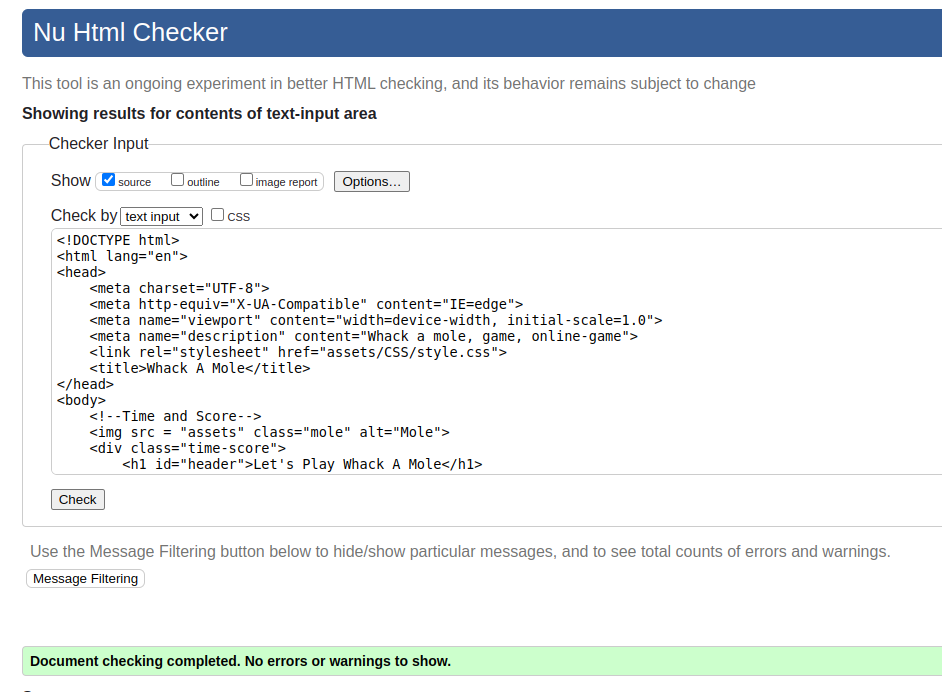
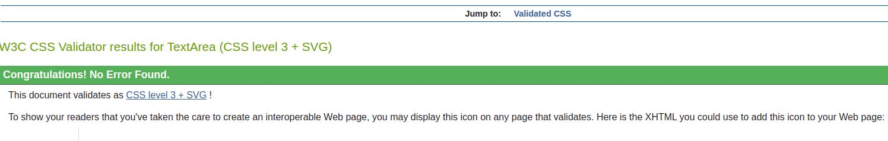
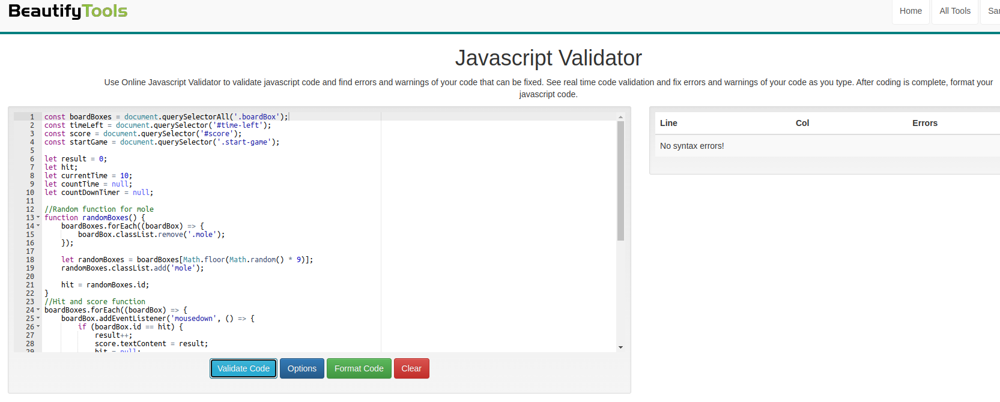
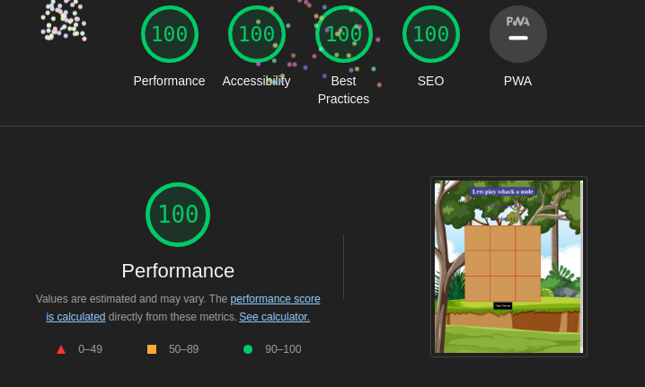

# Whack A Mole

### This is a very simple and fun game made in html, css and javascript.

## Existing Features

### Game Board

>  Game Board are made with 3*3 div tags,class and an id for every box.
> Styled with CSS.

### Score and Timer

> Your score and time left are made by h2 and span in html, and styled with css
> implemented in some functions in Javascript

### The Game itself

> The game itself runs with a random function, (math.floor(math.random() *9))

> I used eventlistener for mouse clicks.

> I used setIntervals for time and gamespeed, (1000 ms = 1sec for speed on mole and countdown on time).

> startbutton is html element styled with css, used javascript for gamestart function
> implementet some variables for reset the game when is over

### Testing

> ### I used W3C Markup Validator to test my html, and there were no errors.
 

 

> ### For CSS i used W3C CSS validation service.
 
 

> ### I also used BeautifyTools for my javascript.
 

 

> ### I tested this on lighthouse.
 

### Deployment
> The site was deployed to GitHub pages. The steps to deploy are as follows:
> In the GitHub repository, navigate to the Settings tab
> From the source section drop-down menu, select the Master Branch
> Once the master branch has been selected, the page will be automatically refreshed with a detailed ribbon display to indicate the successful deployment.

### Live Link

### Content

> Instructions on how to make this is what i learned from CodeIstitute lessons, and some tips from Dave Gray on youtube.

### Media
> Background img and mole img is free, taken from vecteezy.com

### Features Left To Implement
> Different difficulties (Medium and Hard).
> Change pointer arrow to a wooden mallet.
> Add some sounds.
> Add animation when hitting mole.